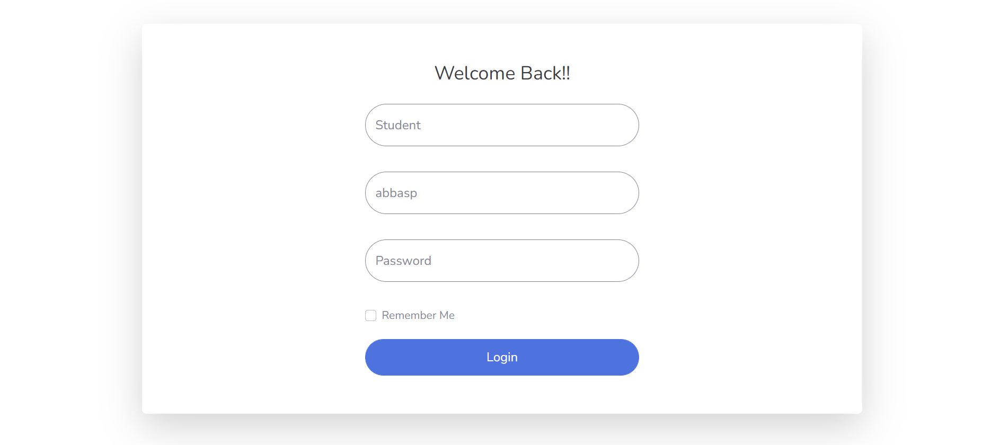
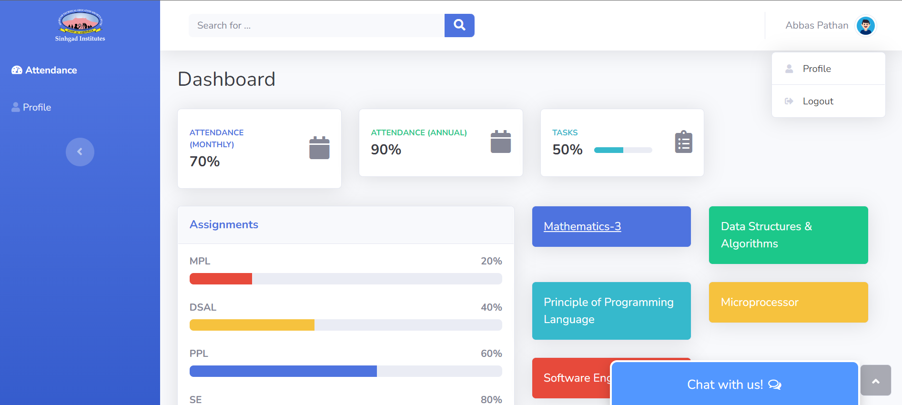

# ERP System
## Submission for College Project 🌟

[](https://github.com/darkling10/) 
[](https://github.com/darkling10/) 
[](https://github.com/darkling10/unite/stargazers) 
[](https://github.com/darkling10/unite/stargazers) 
[](https://github.com/darkling10/unite/network)
[](https://github.com/darkling10/unite)
[](https://github.com/darkling10/unite)
[](https://github.com/darkling10/unite)
[](https://github.com/darkling10/unite)
[](https://github.com/darkling10/unite/) 


## Features and Interfaces

1. Landing Page and Feeback Form
   - Seamless landing page with for different users like student,teacher,admin
   - 
 

2. Home page 
   - Has a signout button and shows differnet stats regarding college.
   - 
   
   - Has a chat bot which helps student if they face any difficulty
   - 
   
   


### Tools and Languages: 
<p align="left"> <a href="https://getbootstrap.com" target="_blank">  </a> <a href="https://www.w3schools.com/css/" target="_blank">  </a> <a href="https://expressjs.com" target="_blank">   </a> <a href="https://cloud.google.com" target="_blank">  </a> <a href="https://git-scm.com/" target="_blank">  </a> <a href="https://heroku.com" target="_blank">  </a> <a href="https://www.w3.org/html/" target="_blank">  </a> <a href="https://developer.mozilla.org/en-US/docs/Web/JavaScript" target="_blank">  </a> <a href="https://www.mongodb.com/" target="_blank">  </a> <a href="https://nodejs.org" target="_blank">  </a> <a href="https://sass-lang.com" target="_blank">  </a> <a href="https://www.tensorflow.org" target="_blank"> </a> </p>


---------

```javascript

if (youEnjoyed) {
    starThisRepository();
}

```

-----------

